# 리드잇(Read It)

------------

## 프로젝트 개요

-------

> 안드로이드 UI를 Jetpack Compose로 개발하는 추세에 따라, Compose에 익숙해지고자 비상업적인 용도로 개발해보게 되었습니다.
> 다양한 컴포넌트를 Compose로 커스텀하고, Navigation과 같은 핵심적인 UI 요소들의 활용에 익숙해지는 것, 그리고 State와 Effect처럼 중요한 개념들을 확실히 공부하는 것이 목표였습니다.   
> 기획 자체는 영화나 드라마, 애니메이션 등에 대한 평가 및 리뷰 플랫폼이 많이 존재하며, 이를 도서 분야에 대해서도 적용해보면 좋을 것 같다는 생각에서 출발했습니다. 
> 일단은 프라이빗하게 읽는 중인 책을 관리하거나, 읽은 책에 대한 간략한 코멘트를 남기고 별점을 부여하는 것을 메인 기능으로 생각했습니다. 
> 그래서 앱 명인 'Read It'은 읽는다와 읽었다를 모두 포함하는 중의적인 의미를 가지도록 의도했습니다.  
> 현재 상태별 책관리(읽는 중/읽을 예정/읽고 별점 부여 완료), 도서 별로 코멘트를 작성하고 열람하는 기능까지 구현한 상태입니다.

## 기능 소개

-------

### 홈 화면

앱을 실행하고 처음 노출되는 화면이며, 유저가 설정해 둔 도서 상태별로 도서 목록을 모아볼 수 있습니다. 
항목 별로 최근에 추가한 책이 먼저 노출됩니다. 
 

    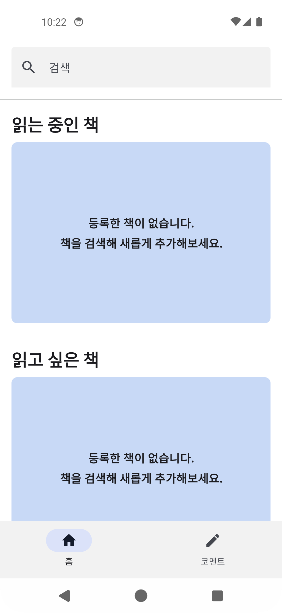
    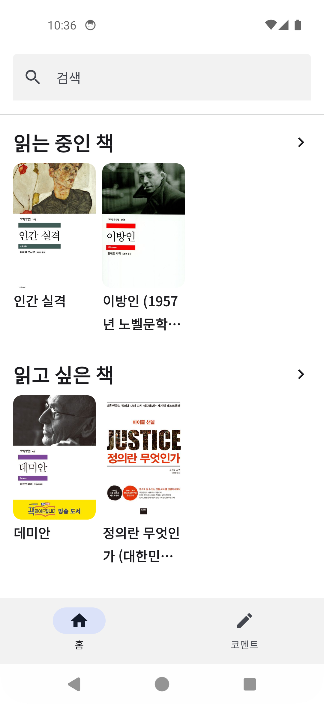

*<해당 목록이 비어있을 때와 비지 않았을 때>*
  

### 홈 화면 - 목록 전체 보기
홈 화면에서는 목록별 최대 20권까지의 책만 노출되기 때문에, 목록 전체를 확인할 수 있는 화면을 따로 제공합니다. 
 

  

### 홈 화면 - 검색
홈 화면 상단에 있는 검색 바를 통해, 도서를 검색할 수 있습니다. 
 

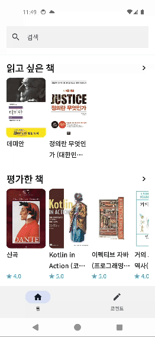

  

### 책 상세 화면
서버나 DB에서 가져온 책에 대한 상세 정보가 제공되며, 책에 대한 상태를 변경하거나 별점 부여, 코멘트 작성 등이 가능합니다. 
 

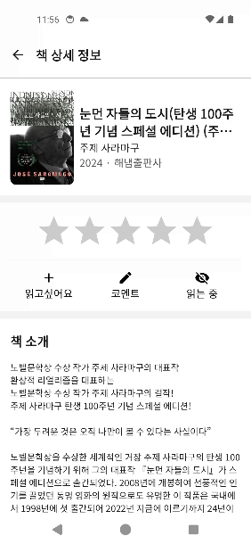

*검색 결과에서 접근할 때*   

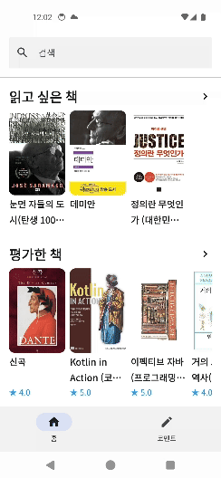

*홈 화면에서 접근할 때*   

### 코멘트 화면

코멘트 탭을 통해서 접근할 수 있으며, 최근에 작성한 코멘트 및 코멘트를 작성한 책들을 확인할 수 있습니다. 

    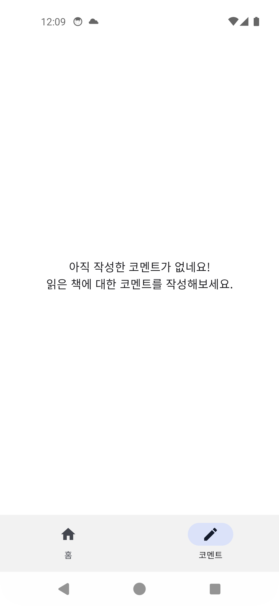
    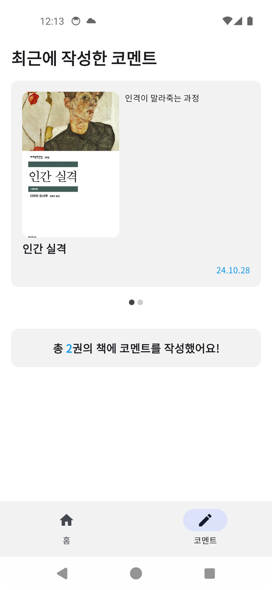

*작성한 코멘트가 존재하지 않을 때와 존재할 때*
  

### 코멘트 편집 화면
책의 상세 화면에서 코멘트 버튼을 이용하거나, 코멘트 탭의 아이템을 눌러 바로 접근할 수 있습니다. 

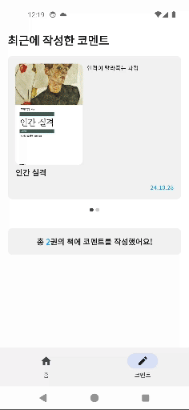

*작성 코멘트 확인*
  

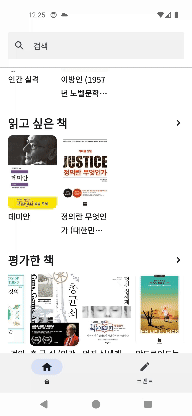

*신규 코멘트 작성*
  

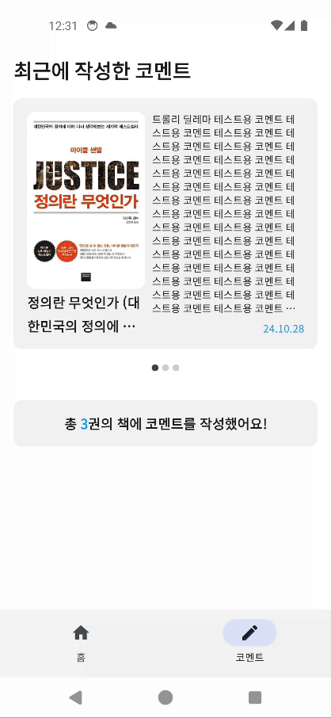

*코멘트 삭제*
  

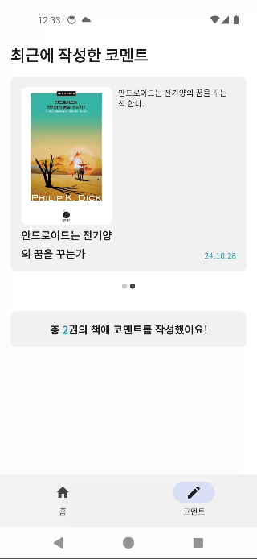

*코멘트 작성 책 일괄 확인*
  

## 개발 환경

------

**버전 처리** 
Target SDK: Android SDK 34 
Min SDK: Android SDK 28 

**UI** 
Jetpack Compose, Material3

**네트워크** 
Retrofit, Okhttp3, Naver Search API

**로컬DB** 
Room

**기타 라이브러리** 
의존성 주입(DI): Hilt 
이미지 처리: Coil 
페이징 처리: Paging3 

## 추후 개발 계획

------

- 최근 검색 내역 이용, 검색 숏컷 칩 제공
- 도서 목록들 정렬 기준 지정
- 개인화 설정